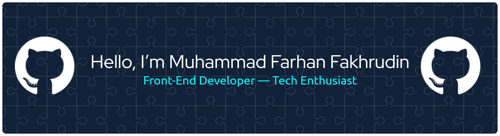

<!-- ### Hello World! I'm Muhammad Farhan Fakhrudin 👋 -->

<!--
**farhanfahrudin14/farhanfahrudin14** is a ✨ _special_ ✨ repository because its `README.md` (this file) appears on your GitHub profile.

Here are some ideas to get you started:

- 🌱 I’m currently learning ...
- 👯 I’m looking to collaborate on ...
- 🤔 I’m looking for help with ...
- 💬 Ask me about ...
- 📫 How to reach me: ...
- 😄 Pronouns: ...
- ⚡ Fun fact: ...
-->

### Hello World! — I'm a Front-End Developer | Tech Enthusiast passionate about building clean, modern, and user-focused web interfaces.
---

##### Skills

<!-- 

 -->

---

##### Connect with me

  

---

##### GitHub Stats:

  

  
  
  

##### GitHub Trophies

---

##### Top Contributed Repo

---

<h2 align="left">Play games with me</h2>

###

<picture>
  <source media="(prefers-color-scheme: dark)" srcset="https://raw.githubusercontent.com/farhanfahrudin14/farhanfahrudin14/output/pacman-contribution-graph-dark.svg">
  <source media="(prefers-color-scheme: light)" srcset="https://raw.githubusercontent.com/farhanfahrudin14/farhanfahrudin14/output/pacman-contribution-graph.svg">
  
</picture>

###

###
